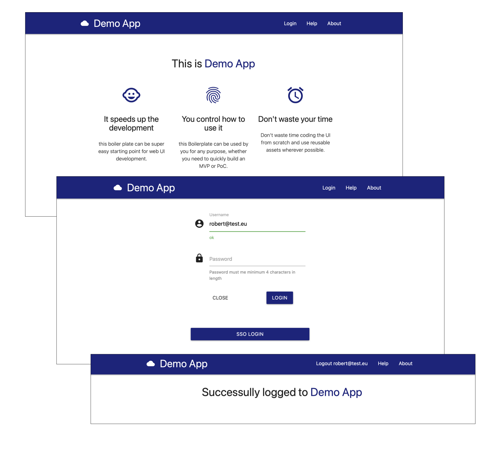
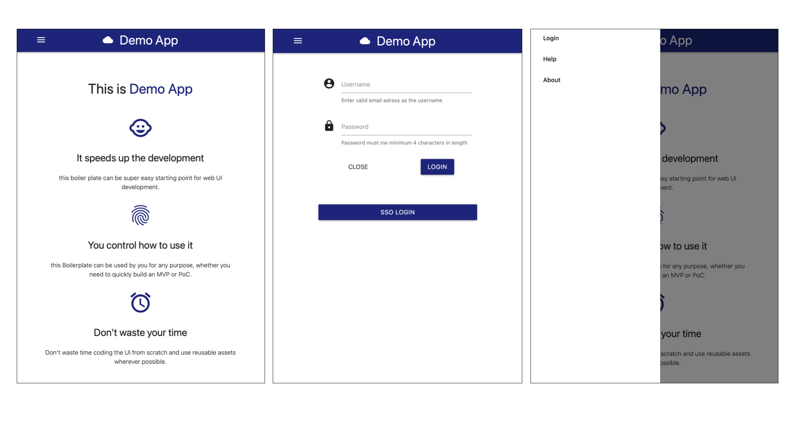

# webapp-boilerplate
Simple boilerplate to build Webapp frontend for IBM Cloud REST API services. 
UI follows the Responsive Web Design rules:

desktop view: 

mobile view: 

## Project goal

It's the simplest webapp for individuals with limited knowledge of front-end development. It allows to build simple front end for REST API services on IBM Cloud. It can be used as the template for your own app. 

Demo App _provides simple user authentication_ so you do not have to develop access control to the app yourself.

Advantages:
 * Angular, Polymer or React sills are NOT required
 * It follows Responsive Web Design, so it can be used for mobile and desktop web browsers
 * it uses Material Design principles

Required skills:
 * HTML, CSS, JS - minimal knowledge required
 * node.js and Express - minimal knowledge required

## How to use it
1) clone the repo
```
git clone git@github.ibm.com:Robert-Kleniewski/webapp-boilerplate.git
```
2) install npm packages
```
cd webapp-boilerplate
npm install
```
3) define app users and passwords
```
data/users.json
```
4) optionally - customise Node.js routes and views for you app
```
routes/main.js 
views/main.hbs
```
5) start your app
```
APPCOLOR=blue APPNAME="Demo App" npm start
```

enjoy :)
